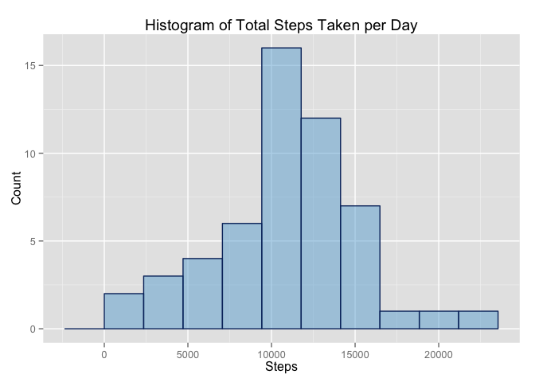
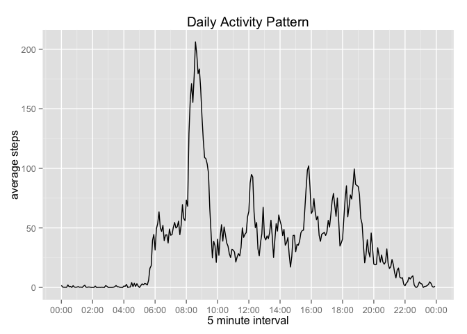
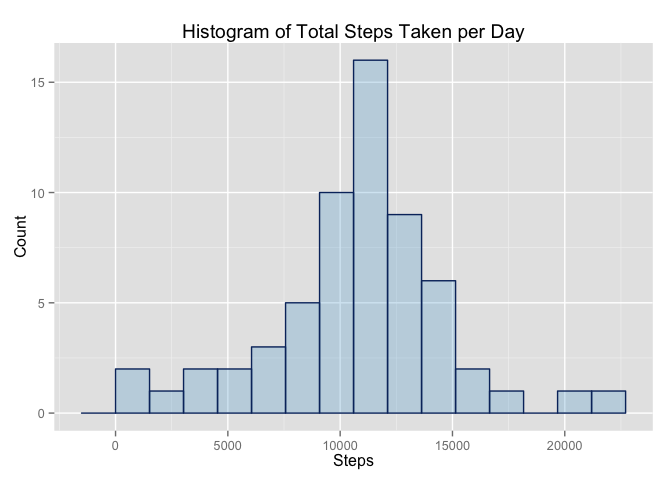
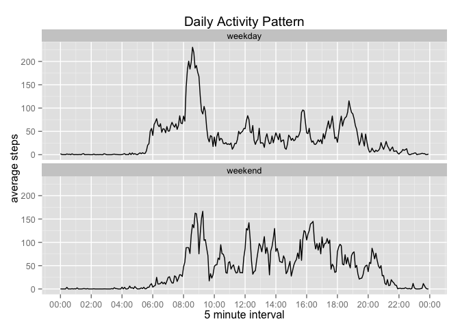

# Reproducible Research: Peer Assessment 1


## Loading and preprocessing the data


```r
library(lubridate)
library(dplyr)
library(ggplot2)
library(scales)

# Make sure activity.zip file is in your R session working directory. 
# Read in the activities file
activities <- read.csv(file=unzip("activity.zip"), stringsAsFactors=FALSE)
 
activities <- activities  %>%  
        mutate(hour = interval %/% 100, minute = interval %% 100)
activities$date_time <- ymd(activities$date)
minute(activities$date_time) <- activities$minute
hour(activities$date_time) <- activities$hour
activities$hr_min <- format(activities$date_time, '%H:%M')
```
## What is mean total number of steps taken per day?

```r
ActivitiesByDay <-  activities[complete.cases(activities),] %>%
        select(steps,date) %>%
        group_by(date)  %>%
        summarise(totalSteps = sum(steps, na.rm=TRUE)) 

# calculate histogram binwidth based on Freedman-Diaconis 
x<- range(ActivitiesByDay$totalSteps)/nclass.FD(ActivitiesByDay$totalSteps)
 
# used this function to select colors -- show_col(brewer_pal()(10))   
ggplot(data=ActivitiesByDay, aes(ActivitiesByDay$totalSteps)) + 
        geom_histogram( binwidth=x[2],
                        fill="#6BAED6",
                        col="#08306B",
                       alpha = .5) + 
        labs(title="Histogram of Total Steps Taken per Day") +
        labs(x="Steps", y="Count")
```

 

```r
meanSteps <- format(mean(ActivitiesByDay$totalSteps))
medianSteps <- median(ActivitiesByDay$totalSteps)
```
Mean of the total number of steps taken per day: 10766.19  
Median of the total number of steps taken per day: 10765  


## What is the average daily activity pattern?


```r
# calculate 5-minute interval (x-axis) and the average number of steps taken, averaged across  # # all days (y-axis)
ActivitiesByInterval <-  activities[complete.cases(activities),] %>%
        select(steps,interval,hr_min) %>%
        group_by(interval, hr_min)  %>%
        summarise(AvgSteps = mean(steps, na.rm=TRUE)) 

# create a "POSIXct" "POSIXt" to display interval in hour:min format on time-series plot below
xx <- activities$date_time[activities$date == "2012-10-01"]

 g <- ggplot(data=ActivitiesByInterval, aes(x = xx, y = AvgSteps))
p <- g + geom_line() + scale_x_datetime(labels = date_format("%H:%M"), 
                                        breaks=date_breaks("2 hour")  ) +
        labs(title="Daily Activity Pattern", x="5 minute interval", 
                            y ="average steps")
p 
```

 

```r
# Determinew Which 5-minute interval, on average across all the days in the dataset, contains the maximum number of steps?

ActivitiesByInterval <- ActivitiesByInterval %>%
        ungroup() %>%
        arrange(desc(AvgSteps))

maxavgsteps <- ActivitiesByInterval[[1,"AvgSteps"]]
maxinterval <- ActivitiesByInterval[[1,"interval"]]
```
Which 5-minute interval, on average across all the days in the dataset, contains the maximum number of steps? Interval 835 on average across all the days in the dataset, contains the maximum number of steps, 206.1698113


## Imputing missing values
Strategy to replace steps missing values involved the following:   

* calculate mean step for each interval (missing values removed)  
* replace steps missing values with the corresponding mean(steps) for that interval


```r
# Calculate the number of missing values.

missingValues <-sum(is.na(activities$steps))

# replace steps NA values

activitiesNoNA <- activities %>%
        group_by(interval) %>%
        mutate(meanrepNA = mean(steps, na.rm=T))
#replace steps NA values with meanrepNA
activitiesNoNA$steps[is.na(activitiesNoNA$steps)] <- activitiesNoNA$meanrepNA
```

```
## Warning in activitiesNoNA$steps[is.na(activitiesNoNA$steps)] <-
## activitiesNoNA$meanrepNA: number of items to replace is not a multiple of
## replacement length
```

```r
UpdtActivitiesPerDay <-  activitiesNoNA %>%
        select(steps,date) %>%
        group_by(date)  %>%
        summarise(totalSteps = sum(steps)) 

# calculate histogram binwidth based on Freedman-Diaconis
x<- range(UpdtActivitiesPerDay$totalSteps)/nclass.FD(UpdtActivitiesPerDay$totalSteps)

ggplot(data=UpdtActivitiesPerDay, aes(UpdtActivitiesPerDay$totalSteps)) + 
        geom_histogram( binwidth=x[2],
                       col="#08306B", 
                       fill="#6BAED6", 
                       alpha = .3) + 
        labs(title="Histogram of Total Steps Taken per Day") +
        labs(x="Steps", y="Count")
```

 

```r
meanStepsNew <- format(mean(UpdtActivitiesPerDay$totalSteps))
medianStepsNew <- format(median(UpdtActivitiesPerDay$totalSteps))
```
Mean of the total number of steps taken per day: 10766.19  
Median of the total number of steps taken per day: 10766.19  

## Are there differences in activity patterns between weekdays and weekends?


```r
# create a factor variable for weekday and weekend day
activitiesNoNA <- activitiesNoNA %>%
        mutate(day = wday(date, label = TRUE))

activitiesNoNA$typeofday[as.character(activitiesNoNA$day) %in% c("Sat","Sun")] <- "weekend"
activitiesNoNA$typeofday[as.character(activitiesNoNA$day) %in% c("Mon","Tues","Wed","Thurs","Fri")] <- "weekday"
activitiesNoNA$typeofday <- as.factor(activitiesNoNA$typeofday)

# # calculate 5-minute interval (x-axis) and the average number of steps taken, averaged across weekdays and weekends

WeekdayVsWeekend <-  activitiesNoNA %>%
        select(steps,interval,typeofday) %>%
        group_by(typeofday,interval)  %>%
        summarise(AvgSteps = mean(steps, na.rm=TRUE)) 

# create a "POSIXct" "POSIXt" to display interval in hour:min format on time-series plot below
xx <- rep(activitiesNoNA$date_time[activities$date == "2012-10-01"],2)
 
# generate time series plot
g <- ggplot(data=WeekdayVsWeekend, aes(x = xx, y = AvgSteps ))
p <- g + geom_line() +facet_wrap(~typeofday, ncol=1) + 
        scale_x_datetime(labels = date_format("%H:%M"), 
        breaks=date_breaks("2 hour")) + labs(title="Daily Activity Pattern",
                x="5 minute interval",  y ="average steps")
p
```

 

